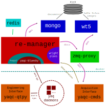

# bluesky-in-a-box 

Bluesky services in docker containers, for use in Wright Group experimental orchestration.



## ports

This application uses the following ports:

| port  | protocol | content           |
| :---- | :------- | :---------------- |
| 27017 | mongo    | databroker        |
| 6379  | redis    | re-manager redis  |
| 5568  | zmq      | re-manager events |
| 60615 | json/zmq | re-manager        |
| 60625 | json/zmq | re-manager logs   |
| 60620 | json/zmq | hwproxy           |

## prepare

```sh
$ apt install docker.io
$ apt install docker-compose
```

## start/rebuild

```sh
$ docker-compose up --build
```

Go to http://localhost:60610/docs to see queueserver api. Note: not active at this time.

## Installing bluesky-in-a-box on Windows

### Downloads

- Docker desktop: docker.com/products/docker-desktop
- bluesky-in-a-box: `git clone https://github.com/wright-group/bluesky-in-a-box`
- bluesky-cmds: `git clone https://github.com/wright-group/bluesky-cmds` (option gui)

### Install
- conda install happi
- conda install yaqc-bluesky
- conda install bluesky-queueserver
- conda install bluesky-hwproxy
- conda install bluesky-widgets
- conda install yaqc-qtpy
- conda install sympy
- run `wsl --install`
- run installer for docker desktop
- reboot machine, ensure virtualization is enabled. This is sometimes called KVM, or Intel Virtualization Technology. It is often off by default, but is needed for wsl2/docker
- I personally like to do `wsl --install -d debian` but that is more of a preference than a requirement

- Toggle settings for docker desktop:
   - At least until this is the primary way of collecting data on a system, I prefer not to start at login/open dashboard at startup.
   - I do not want to pop up with weekly tips or send usage stats
   - I do enable docker compose V2
   - Additionally under resources -> wsl integration I enable for all distros I have installed

- Install bluesky-cmds python program (eventually will be conda/pip install)
   - conda install flit
   - ensure dependencies of bluesky-cmds are installed
   - flit install --deps none --pth-file
   - run `bluesky-cmds edit-config` to populate the config file, default should be correct

### Configure hardware

- Set up happi db
  - Create folder `~\AppData\Local\happi\happi\`
  - cd to folder above
  - Create file in above folder "happi.ini":

```ini
[DEFAULT]
path = C:\Users\<USERNAME>\AppData\Local\happi\happi\happidb.json
```

  - run `set HAPPI_CFG=C:\Users\<USERNAME>\AppData\Local\happi\happi\happi.ini`
     - This line needs to be run every time you wish to interact with happi... there should be a way to make it more automatic
  - `yaqd list --format happi |  happi update -`

### Configure folders

- Create folder for data output
  - Create `~/bluesky-cmds-data` (Wherever you want data to go, should match `WT5_DATA_PATH` below

- Edit .env for bluesky-in-a-box
  - `copy .env-example .env`
  - edit .env
     - set `HAPPI_DB_PATH=C:\Users\<USERNAME>\AppData\Local\happi\happi\happidb.json`
     - set `WT5_DATA_PATH=C:\Users\<USERNAME>\bluesky-cmds-data`
     - set `TZ=America/Chicago` (or whatever timezone you are in)

### Start/Update Containers

- Start your docker
  - if needed, checkout/pull the apporopriate branch which may have fixes for your system
  - from bluesky-in-a-box root directory do `docker compose up --build`
  - This will take a while the first time, but much is cached for future builds if things change
  - Future updates will redo this step with the appropriate fixes in the local version
  - Use `docker compose build --no-cache` to force a full rebuild (should be rare)


### config databroker
  - add catalog.yml to `databroker.catalog_search_path`
  - By default: C:\Users\<USERNAME>\AppData\Local\intake\intake\catalog.yml

```yaml
# ~/.local/share/intake/catalog.yml
sources:
  mongo:
    driver: bluesky-mongo-normalized-catalog
    args:
      metadatastore_db: mongodb://localhost:27017/metadatastore
      asset_registry_db: mongodb://localhost:27017/asset_registry
```

  - This allows you to load data from the mongo server (in addition to the wt5 files)
